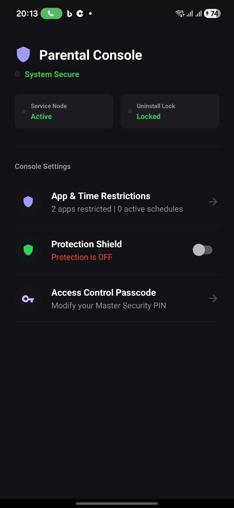
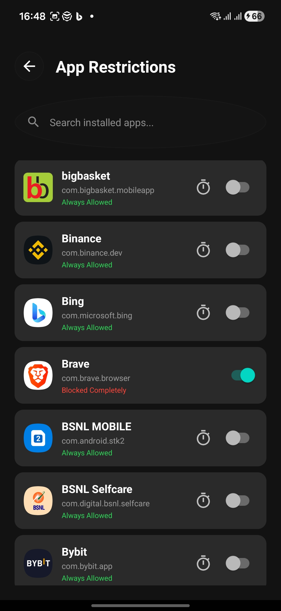
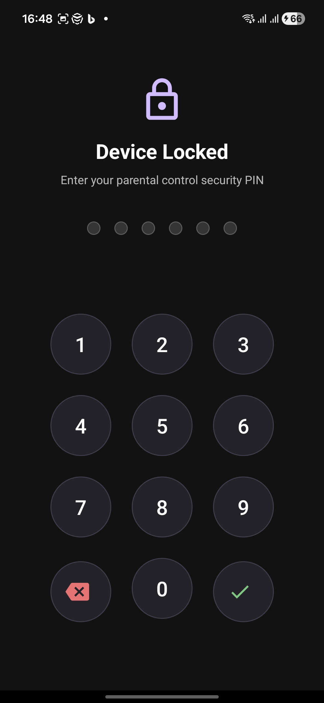

# Parental Control Android Application

A secure, high-fidelity native Android application engineered for parental device control, content monitoring, and application locking. The system is designed with a handcrafted dark-mode dashboard console, local SHA-256 PIN authentication, dynamic accessibility state listeners, and Package Visibility configurations.

## Visual Identity

<p align="center">
  
  
  
  
</p>

---

## Key Capabilities

### Handcrafted Dashboard Redesign
* **Rectangular Status Badges**: Replaced legacy oval layouts with modern, flat 8dp rounded-corner MaterialCardView elements for accessibility and administration states.
* **Consolidated System Health**: A unified tri-state system health header (Secure, Action Recommended, Unsecured) updates dynamically depending on device permissions.
* **Borderless Controls Settings**: Replaced card-nested sections with a modern settings console utilizing horizontal dividers, subtle lavender icons, and right chevrons.

### Installed Package Discovery (Android 11+ Visibility)
* Resolves Android package visibility sandbox restrictions on API level 30 and above.
* Declares the QUERY_ALL_PACKAGES permission, enabling queryIntentActivities to scan and list all installed third-party apps (WhatsApp, YouTube, games) to let parents apply restrictions.

### Secure Offline Keystore Generation
* An automated generator utility builds self-signed production keys locally using OpenSSL or Java Keytool.
* Dynamic Gradle integration loads credentials from local isolated properties only if present, falling back gracefully to keep public source code safe.

---

## Directory Architecture

* `app/` - Primary application module containing Kotlin sources, XML layouts, and assets.
* `images/` - Directory for visual assets, launcher mockups, and screenshots.
* `artifacts/` - Output target directory for generated debug and release APK packages (ignored by Git).
* `.github/workflows/` - Continuous integration workflow definitions for GitHub Actions.
* `build.sh` - Compiled sandboxed build script running builds inside isolated Docker containers.
* `generate_keystore.py` - Automation utility script generating keystores, properties mapping files, and base64 strings.

---

## Local Compilation and Build Pipeline

All compilations run inside an isolated, identical build container via Docker, eliminating the need to install the JDK or Android SDK on the host machine.

### Prerequisites
* Docker engine installed and running.
* ADB command-line utility for device installation.

### 1. Compile Unsigned Debug Package
To run pre-flight syntax validations and compile the unsigned debug package:
```bash
./build.sh
```
* **Output Package**: `artifacts/app-debug.apk`

### 2. Compile Signed Release Package
To package, sign, and build a release APK using your local secure keystore:
1. Generate local private credentials:
   ```bash
   ./generate_keystore.py
   ```
2. Compile using the release switch:
   ```bash
   ./build.sh --release
   ```
* **Output Package**: `artifacts/app-release.apk`

---

## Secure Keystore Setup and Git Protection

### Automated Credentials Utility
Run the root generation utility script:
```bash
./generate_keystore.py
```
The script performs the following actions:
1. Generates a secure, 16-character alphanumeric password.
2. Automates OpenSSL or JKS keystore generation based on system availability.
3. Builds local `keystore.properties` mapped dynamically to Gradle signing configurations.
4. Outputs the Base64 representation of the binary keystore for remote CI/CD integration.

### Git Security
The files `release.keystore` and `keystore.properties` contain highly sensitive private credentials. They are defined inside `.gitignore` and are strictly excluded from being tracked or pushed to public repositories.

---

## Continuous Integration and Deployment (GitHub Actions)

A pre-configured CI/CD workflow is declared at `.github/workflows/android.yml` to compile and sign production APKs on every repository push.

### Required Repository Secrets Configuration
To enable signed remote builds, configure the following secrets inside your GitHub Repository settings (Settings -> Secrets and variables -> Actions -> New repository secret):

| Secret Name | Secret Value Source | Description |
| :--- | :--- | :--- |
| `KEYSTORE_BASE64` | Output from `generate_keystore.py` | Base64 text string representing your binary keystore file. |
| `KEYSTORE_PASSWORD` | Output from `generate_keystore.py` | The master keystore password. |
| `KEY_ALIAS` | `parentalcontrol-alias` | The key alias within the keystore. |
| `KEY_PASSWORD` | Output from `generate_keystore.py` | The key-specific password. |

Once the pipeline completes, the signed release APK is automatically published directly to the **Releases** section of your GitHub repository. You can download the raw, pre-compiled signed `app-release.apk` with a single click from the Releases page (mapped to the `latest` tag).

---

## Physical Device Installation

To deploy a compiled APK directly to your connected physical test device:

```bash
# Debug APK
adb install artifacts/app-debug.apk

# Signed Release APK
adb install artifacts/app-release.apk
```
